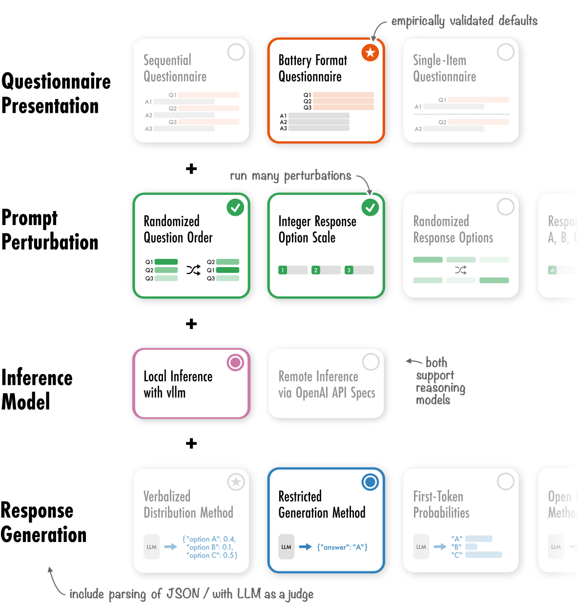

# QSTN: A Modular Framework for Robust Questionnaire Inference with Large Language Models
    
<div align="center">



</div>

QSTN is a Python framework designed to facilitate the creation of robust inference experiments with Large Language Models based around questionnaires. It provides a full pipeline from perturbation of prompts, to choosing Response Generation Methods, inferencing and finally parsing of the output. QSTN supports both local inference with vllm and remote inference via the OpenAI API.

Detailed information and guides are available in our [documentation](https://qstn.readthedocs.io/en/latest/). Tutorial notebooks can also be found in this [repository](https://github.com/dess-mannheim/QSTN/tree/main/docs/guides).

## Installation

Make sure that the python version in your environment is at least 3.12

We support two type of installations:  
    1. The **base version**, which only installs the dependencies neccessary to use the OpenAI API.  
    2. The **full version**, which supports both API and local inference via `vllm`.

To install both of these version you can use `pip` or `uv`.

The base version can be installed with the following command:

```bash
pip install qstn
```

The full version can be installed with this command:

```bash
pip install qstn[vllm]
```

You can also install this package from source:

```bash
pip install git+https://github.com/dess-mannheim/QSTN.git
```

## Getting Started

Below you can find a minimum working example of how to use QSTN. It can be easily integrated into existing projects, requiring just three function calls to operate. Users familiar with vllm or the OpenAI API can use the same Model/Client calls and arguments. In this example reasoning and the generated response are automatically parsed. For more elaborate examples, see the [tutorial notebooks](https://github.com/dess-mannheim/QSTN/tree/main/docs/guides).

```python
import qstn
import pandas as pd
from vllm import LLM

# 1. Prepare questionnaire and persona data
questionnaires = pd.read_csv("hf://datasets/qstn/ex/q.csv")
personas = pd.read_csv("hf://datasets/qstn/ex/p.csv")
prompt = (
    f"Please tell us how you feel about:\n"
    f"{qstn.utilities.placeholder.PROMPT_QUESTIONS}"
)
interviews = [
    qstn.prompt_builder.LLMPrompt(
        questionnaire_source=questionnaires,
        system_prompt=persona,
        prompt=prompt,
    ) for persona in personas.system_prompt]

# 2. Run Inference
model = LLM("Qwen/Qwen3-4B", max_model_len=5000)
results = qstn.survey_manager.conduct_survey_single_item(
    model, interviews, max_tokens=500
)

# 3. Parse Results
parsed_results = qstn.parser.raw_responses(results)
```

## Citation

If you find QSTN useful in your work, please cite our [paper](https://arxiv.org/abs/2512.08646):

```bibtex
@inproceedings{kreutner-etal-2026-qstn,
    title = "{QSTN}: A Modular Framework for Robust Questionnaire Inference with Large Language Models",
    author = "Kreutner, Maximilian  and
      Rupprecht, Jens  and
      Ahnert, Georg  and
      Salem, Ahmed  and
      Strohmaier, Markus",
    editor = "Croce, Danilo  and
      Leidner, Jochen  and
      Moosavi, Nafise Sadat",
    booktitle = "Proceedings of the 19th Conference of the {E}uropean Chapter of the {A}ssociation for {C}omputational {L}inguistics (Volume 3: System Demonstrations)",
    month = mar,
    year = "2026",
    address = "Rabat, Marocco",
    publisher = "Association for Computational Linguistics",
    url = "https://aclanthology.org/2026.eacl-demo.37/",
    doi = "10.18653/v1/2026.eacl-demo.37",
    pages = "537--549",
    ISBN = "979-8-89176-382-1"
}
