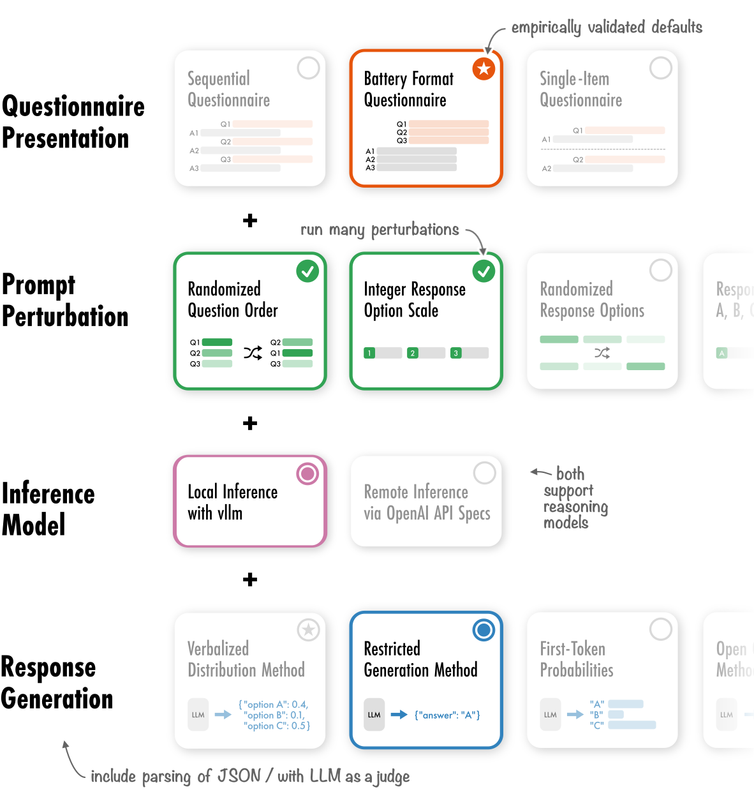

# QSTN

QSTN is a Python framework designed to facilitate the creation of robust inference experiments with Large Language Models based around questionnaires. It provides a full pipeline from perturbation of prompts, to choosing Response Generation Methods, inferencing and finally parsing of the output. QSTN supports both local inference with [vllm](https://github.com/vllm-project/vllm) and remote inference via the [OpenAI API](https://github.com/openai/openai-python).



## Tutorials

We show a number of tutorials here, starting with an installation and a minimum usage example.

We also show how to use `QSTN` for real experiments, including how to use it to get answers from the German General Personas Dataset.

```{toctree}
:caption: Getting Started
:maxdepth: 3

installation
quickstart
```

```{toctree}
:caption: Tutorials
:maxdepth: 2

guides/index
resources/index
```

## API Reference

The full documentation can be found below.

```{toctree}
:caption: API Reference
:maxdepth: 5

api_reference
```
